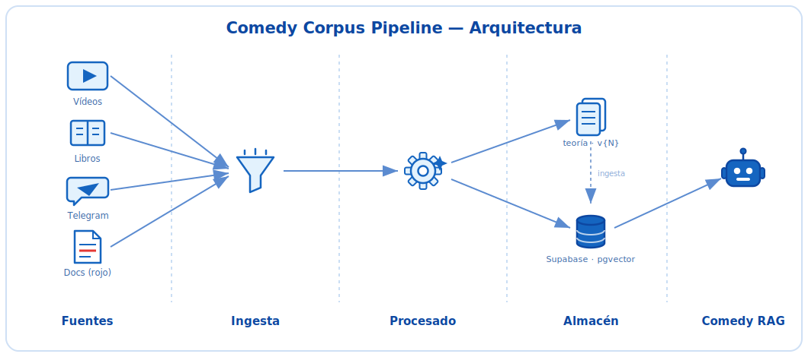

# Comedy Corpus Pipeline


> Pipeline de **ingesta, limpieza, estructuración y versionado** de datos para el
> **Comedy RAG**. Corpus **multi-fuente**: cada unidad lleva `tipo_fuente` para
> permitir *retrieval* separado por origen en el RAG *downstream*.

**Estado:** 17/21 tareas del backlog cerradas (ver [`feature_list.json`](feature_list.json)).
- **Flujo A (Teoría):** completo — los 8 componentes de la cadena implementados
  y testeados (`DriveMonitor` → ... → `FormatNormalizer` → `/data/processed/v{N}/`),
  más `validate_corpus.py` como gate de validación.
- **Contrato compartido B/C:** `supabase_store.py` + DDL, `silver.py` (LLM) y el
  mapeo de taxonomías (loop acotado P16) implementados; falta `reconciliacion.py`
  (dedup hash+embedding, task 15).
- **Flujo C (Histórico):** `marcar_remates.py` y `loader.py` implementados; falta
  `segmentador.py` (task 19).
- **Flujo B (Telegram):** pendiente (`telegram_bot.py`, task 16).
- **Ingesta de teoría a Supabase** (`teoria_chunks`, task 21): pendiente.

**Metodología:** SDD estricto (spec → tests con fixtures reales → implementación).
**Fuente de verdad:** [`docs/specs/00-overview.md`](docs/specs/00-overview.md) — la spec
está partida por módulo y colocada junto al código que gobierna (ver tabla abajo).

---

## Arquitectura

Flujo de datos de izquierda a derecha: cada fuente entra por su ingesta, pasa por su
procesado y aterriza en el almacén correspondiente, que alimenta el RAG.

<p align="center">
  
</p>

> ✱ **WhisperX** (transcripción vídeo→texto) es un paso previo de captación que corre
> en Google Colab con GPU, fuera del pipeline determinista. Ver
> [`docs/reference/whisperx_transcribe_colab.py`](docs/reference/whisperx_transcribe_colab.py).

---

## Los tres flujos

| Flujo | Módulo | Origen | Naturaleza | Destino |
|-------|--------|--------|------------|---------|
| **A — Teoría** | `src/theory/` | Libros/cursos (`data/raw/books/` local; Drive real diferido, P18) | Batch, **determinista**, coste 0 | Ficheros `/data/processed/v{N}/` |
| **B — Chistes propios** | `src/jokes/telegram/` (+ `src/jokes/` compartido) | Telegram (tiempo real) | Bronze → Silver (LLM) | Supabase |
| **C — Chistes históricos** | `src/jokes/historico/` (+ `src/jokes/` compartido) | Textos propios ya escritos | Batch retroactivo | Supabase |

**`tipo_fuente`** (enum cerrado): `teoria · transcripcion_curso · propio · propio_historico`
- `externo*` = `{teoria, transcripcion_curso}` → limpieza agresiva, ficheros `v{N}`.
- `propio*` = `{propio, propio_historico}` → Bronze/Silver, Supabase, versión por chiste.

### Notas de diseño clave
- **Orden en teoría:** `SubtypeDetector` ejecuta **antes** que el `Cleaner` (los
  fragmentos `ejemplo` tienen reglas de limpieza distintas y conservan el estilo oral).
- **Histórico por color:** el remate viene marcado en rojo en el `.docx`.
  `#FF0000 → [REMATE]` (cierra el chiste) y `#980000 → [CHISTOIDE]` (mini-remate
  interno, **no** es frontera; se conserva como metadato). Marcado **automático**.
- **Sin LLM en teoría** (determinista, coste 0). Excepción acotada: el **Silver** de
  chistes usa un LLM barato vía API.
- **Parser de teoría vía markitdown** (P17): `pdf_parser`/`docx_parser` convierten a
  Markdown con [`markitdown`](https://github.com/microsoft/markitdown); Tesseract
  queda como *fallback* OCR para páginas escaneadas. Nunca toca `/data/raw/` (sagrado).
- **DriveMonitor sobre carpeta local** (P18, de momento): vigila `data/raw/books/` y
  `data/raw/notes/` en vez de la API de Google Drive — misma idempotencia por hash MD5.
  La integración real con Drive queda diferida, sin tocar el resto de la cadena.

---

## Layout del repo

```
src/
├── utils/            # COMPARTIDO: language_detector, quality_scorer, llm/ — SPEC.md
├── theory/           # Flujo A: drive_monitor, parsers/, cleaners/, normalizers/, pipeline.py — SPEC.md
└── jokes/            # Contrato compartido B/C: silver, reconciliacion, supabase_store — SPEC.md
    ├── telegram/       # Flujo B: telegram_bot — SPEC.md
    └── historico/      # Flujo C: loader, segmentador — SPEC.md
scripts/         # run_pipeline · run_historico · marcar_remates · validate_corpus · stats_report
docs/            # specs/ (overview + política LLM), reference/, CORPUS_INVENTORY.md
tests/           # unit/ · integration/ · fixtures/ (reales, nunca inventados)
data/            # corpus (NO versionado): raw/ (sagrado) · processed/ · state/
```

Cada carpeta con lógica propia trae su `SPEC.md` — no hace falta leer toda la spec
para tocar un módulo. Directriz completa en
[`docs/specs/00-overview.md`](docs/specs/00-overview.md).

**Regla de dependencias:** `theory/` y `jokes/` **no** se importan entre sí. Lo común va a `utils/`.

---

## Stack

**Teoría (coste 0):** `markitdown` (PDF/DOCX → Markdown, P17), `pytesseract` +
`pdf2image` (OCR *fallback* para escaneados), `ebooklib` (EPUB), `langdetect`,
`deep-translator` (DeepL free tier), `APScheduler`, `google-api-python-client`
(Drive real, diferido — P18).
**Chistes:** Supabase (Postgres + pgvector), `python-telegram-bot`, cliente LLM vía API, embeddings.

---

## Puesta en marcha

```bash
cp .env.example .env          # y rellena tus credenciales
bash init.sh                  # crea .venv/, instala dependencias, valida el entorno
source .venv/bin/activate
pytest tests/unit -v          # tests unitarios
pytest tests/integration -v   # tests de integración
python scripts/validate_corpus.py   # antes de cada commit
```

> `init.sh` crea el venv porque el sistema puede ser "externally-managed" (PEP 668)
> y rechazar `pip install` directo contra el Python global.

---

## Datos y copyright

- `data/raw/` (teoría) y la capa **Bronze** (chistes) son **material original: sagrado**.
  Nunca se modifica, elimina ni sobrescribe. Todo el trabajo ocurre aguas abajo.
- El corpus **no se versiona en git** (copyright, tamaño, privacidad): `data/` está en
  `.gitignore`. El material de cursos es de pago y no redistribuible.
- `licencia` es metadata con *default* seguro; sin lógica de *enforcement* por ahora.

---

## Documentos

**Specs** (empezar por overview; cada módulo trae el suyo, ver directriz de lectura):
- [Overview + directriz de lectura](docs/specs/00-overview.md) — **punto de entrada**
- [Política LLM, coste y copyright (P16)](docs/specs/llm-policy.md)
- [`src/theory/SPEC.md`](src/theory/SPEC.md) — Flujo A (Teoría)
- [`src/jokes/SPEC.md`](src/jokes/SPEC.md) — contrato compartido B/C (Silver, Reconciliación, Taxonomías)
- [`src/jokes/telegram/SPEC.md`](src/jokes/telegram/SPEC.md) — Flujo B (Telegram)
- [`src/jokes/historico/SPEC.md`](src/jokes/historico/SPEC.md) — Flujo C (Histórico)
- [`src/utils/SPEC.md`](src/utils/SPEC.md) — código compartido

**Otros:**
- [Roadmap de Fase 0](ROADMAP_DATA_PIPELINE.md)
- [Inventario del corpus](docs/CORPUS_INVENTORY.md)
- [Guía operativa para Claude Code](CLAUDE.md)
- [Resumen de arquitectura para LLM](docs/PROJECT_SUMMARY_FOR_LLM.md)

**Harness de agentes** (modo EJECUTOR — leader/planner/implementer/reviewer):
- [Mapa de agentes](AGENTS.md) · [Criterios de validación](CHECKPOINTS.md) · [Backlog](feature_list.json)
