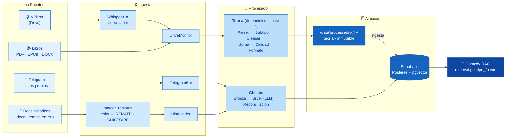

# Comedy Corpus Pipeline

> Pipeline de **ingesta, limpieza, estructuración y versionado** de datos para el
> **Comedy RAG**. Corpus **multi-fuente**: cada unidad lleva `tipo_fuente` para
> permitir *retrieval* separado por origen en el RAG *downstream*.

**Estado:** Fase 0 — spec aprobada, estructura creada, pre-implementación.
**Metodología:** SDD estricto (spec → tests con fixtures reales → implementación).
**Fuente de verdad:** [`docs/specs/comedy-corpus-pipeline.md`](docs/specs/comedy-corpus-pipeline.md).

---

## Arquitectura

Flujo de datos de izquierda a derecha: cada fuente entra por su ingesta, pasa por su
procesado y aterriza en el almacén correspondiente, que alimenta el RAG.



> ✱ **WhisperX** (transcripción vídeo→texto) es un paso previo de captación que corre
> en Google Colab con GPU, fuera del pipeline determinista. Ver
> [`docs/reference/whisperx_transcribe_colab.py`](docs/reference/whisperx_transcribe_colab.py).

---

## Los tres flujos

| Flujo | Módulo | Origen | Naturaleza | Destino |
|-------|--------|--------|------------|---------|
| **A — Teoría** | `src/theory/` | Libros/cursos desde Drive | Batch, **determinista**, coste 0 | Ficheros `/data/processed/v{N}/` |
| **B — Chistes propios** | `src/jokes/` | Telegram (tiempo real) | Bronze → Silver (LLM) | Supabase |
| **C — Chistes históricos** | `src/jokes/historico/` | Textos propios ya escritos | Batch retroactivo | Supabase |

**`tipo_fuente`** (enum cerrado): `teoria · transcripcion_curso · propio · propio_historico`
- `externo*` = `{teoria, transcripcion_curso}` → limpieza agresiva, ficheros `v{N}`.
- `propio*` = `{propio, propio_historico}` → Bronze/Silver, Supabase, versión por chiste.

### Notas de diseño clave
- **Orden en teoría:** `SubtypeDetector` ejecuta **antes** que el `Cleaner` (los
  fragmentos `ejemplo` tienen reglas de limpieza distintas y conservan el estilo oral).
- **Histórico por color:** el remate viene marcado en rojo en el `.docx`.
  `#FF0000 → [REMATE]` (cierra el chiste) y `#980000 → [CHISTOIDE]` (mini-remate
  interno, **no** es frontera; se conserva como metadato). Marcado **automático**.
- **Sin LLM en teoría** (determinista, coste 0). Excepción acotada: el **Silver** de
  chistes usa un LLM barato vía API.

---

## Layout del repo

```
src/
├── utils/       # COMPARTIDO: language_detector, quality_scorer, llm/ (cliente + embeddings)
├── theory/      # Flujo A: drive_monitor, parsers/, cleaners/, detectors/, normalizers/, pipeline.py
└── jokes/       # Flujos B/C: telegram_bot, silver, reconciliacion, supabase_store, historico/
scripts/         # run_pipeline · run_historico · marcar_remates · validate_corpus · stats_report
docs/            # specs/ (fuente de verdad), reference/, CORPUS_INVENTORY.md
tests/           # unit/ · integration/ · fixtures/ (reales, nunca inventados)
data/            # corpus (NO versionado): raw/ (sagrado) · processed/ · state/
```

**Regla de dependencias:** `theory/` y `jokes/` **no** se importan entre sí. Lo común va a `utils/`.

---

## Stack

**Teoría (coste 0):** `pytesseract` + `pdf2image` (OCR), `ebooklib` (EPUB),
`python-docx` (DOCX), `pymupdf` (PDF), `langdetect`, `deep-translator`,
`APScheduler`, `google-api-python-client`.
**Chistes:** Supabase (Postgres + pgvector), `python-telegram-bot`, cliente LLM vía API, embeddings.

---

## Puesta en marcha

```bash
pip install -r requirements.txt
cp .env.example .env          # y rellena tus credenciales
pytest tests/unit -v          # tests unitarios
pytest tests/integration -v   # tests de integración
python scripts/validate_corpus.py   # antes de cada commit
```

---

## Datos y copyright

- `data/raw/` (teoría) y la capa **Bronze** (chistes) son **material original: sagrado**.
  Nunca se modifica, elimina ni sobrescribe. Todo el trabajo ocurre aguas abajo.
- El corpus **no se versiona en git** (copyright, tamaño, privacidad): `data/` está en
  `.gitignore`. El material de cursos es de pago y no redistribuible.
- `licencia` es metadata con *default* seguro; sin lógica de *enforcement* por ahora.

---

## Documentos

- [Especificación completa (v2 multi-fuente)](docs/specs/comedy-corpus-pipeline.md) — **fuente de verdad**
- [Roadmap de Fase 0](ROADMAP_DATA_PIPELINE.md)
- [Inventario del corpus](docs/CORPUS_INVENTORY.md)
- [Guía operativa para Claude Code](CLAUDE.md)
