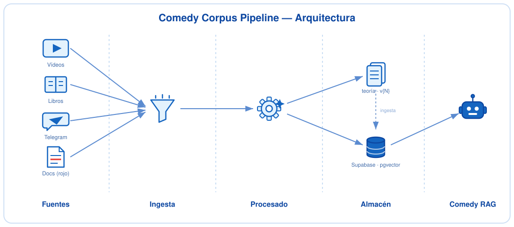

# Comedy Corpus Pipeline


> Pipeline de **ingesta, limpieza, estructuración y versionado** de datos para el
> **Comedy RAG**. Corpus **multi-fuente**: cada unidad lleva `tipo_fuente` para
> permitir *retrieval* separado por origen en el RAG *downstream*.

**Estado:** 63/69 tareas del backlog cerradas (ver [`feature_list.json`](feature_list.json)).
Los tres flujos están en producción real (Supabase + VPS), y **P25** — la
reorganización del almacenamiento a tres schemas reales de Postgres
(`bronze`/`silver`/`gold`, con Bronze durable también en Storage para
Teoría e Histórico, no solo Telegram) — está **ejecutada en el proyecto
Supabase real** (cutover, task 56) y prácticamente cerrada para Flujo A.
Las 6 tareas restantes (64-69, `pending`) extienden P25 a Flujo C (captura
Bronze/Silver del histórico), ejecutan el backfill retroactivo del material
de teoría ya existente en local, añaden la validación de topología
cross-capa a `validate_corpus.py` y actualizan la documentación de overview
al estado post-P25. `schema.sql` (3 schemas) está aplicado por completo en
el proyecto Supabase real y `pytest tests/integration -v` pasa contra
Supabase + Gemini reales.
- **Flujo A (Teoría):** completo y migrado a P25 — la cadena
  `DriveSync → DocumentStore (Bronze) → Parser → ... → FormatNormalizer →
  DocumentStore (Silver)` sube el original intacto a `bronze.teoria_documentos`
  (bucket `bronze-teoria`) y el `.md` limpio/traducido a
  `silver.teoria_documentos` (bucket `silver-teoria`) — el pipeline **ya no
  escribe `/data/processed/v{N}/`** (retirado en la task 63; el código de
  `generar_version` se conserva sin llamador, ver `format_normalizer.py`).
  `ingest_teoria.py` puebla `gold.teoria_chunks` leyendo directamente de
  Silver (task 61), y `validate_corpus.py` valida el contenido de las filas
  Silver vigentes en vez de un `manifest.json` (task 62). `src/theory/pipeline.py`
  (orquestador importable) y `scripts/run_pipeline.py` (CLI estable,
  `--sync-drive`/`--capturar-bronze`/`--ingest`) exponen todo esto por
  inyección, con el modo solo-local original intacto bit a bit. Pendiente
  (tasks 66-67): backfill retroactivo del material ya presente en
  `data/raw/` (7 libros + 25 transcripciones) a Bronze en modo legacy.
- **Contrato compartido B/C:** `supabase_store.py`/`teoria_store.py`
  *schema-aware* (task 54), `src/jokes/routing.py` compartido (tasks 33-34),
  `silver.py` (LLM), taxonomías (loop acotado P16), `reconciliacion.py`
  (dedup hash+embedding) y `document_store.py` (`src/utils/`, task 58 —
  componente compartido de captura durable Bronze/Silver por Drive o modo
  legacy, orden objeto-antes-que-fila, usado ya por Teoría) implementados.
- **Flujo C (Histórico):** completo end-to-end sobre el modelo pre-P25
  (`marcar_remates.py`, `loader.py`, `segmentador.py`, integración real con
  Drive, `coste.py` como gate de presupuesto, `historico/pipeline.py` +
  `scripts/run_historico.py`, cron semanal desatendido). Pendiente (tasks
  64-65, planificadas): extender la captura Bronze/Silver de P25 también a
  este flujo (`bronze.historico_documentos`/`silver.historico_documentos`),
  mismo patrón ya validado en Flujo A.
- **Flujo B (Telegram):** **en producción real**, vía **webhook** (no
  polling) — orquestador Bronze→Silver→Reconciliación, app FastAPI con
  validación de `secret_token`, respuesta 200 inmediata con el tramo LLM en
  background, recuperación de fallos post-200 vía columna `procesado_at` +
  script de reproceso, desplegado en contenedor Docker (GitHub Actions +
  SSH) detrás de Caddy en el puerto 8443 del VPS, con TLS vía DNS-01
  (Porkbun). Ya migrado a P25 (`bronze.chistes_telegram`/`silver.chistes`).
- **Ingesta de teoría a Supabase** (`gold.teoria_chunks` + índice pgvector
  compartido): implementada, leyendo de `silver.teoria_documentos`
  (`src/theory/ingest_teoria.py`, task 61).

**Metodología:** SDD estricto (spec → tests con fixtures reales → implementación).
**Fuente de verdad:** [`docs/specs/00-overview.md`](docs/specs/00-overview.md) — la spec
está partida por módulo y colocada junto al código que gobierna (ver tabla abajo).

---

## Arquitectura

Flujo de datos de izquierda a derecha: cada fuente entra por su ingesta, pasa por su
procesado y aterriza en el almacén correspondiente, que alimenta el RAG.

<p align="center">
  
</p>

> ✱ **WhisperX** (transcripción vídeo→texto) es un paso previo de captación que corre
> en Google Colab con GPU, fuera del pipeline determinista. Ver
> [`docs/reference/whisperx_transcribe_colab.py`](docs/reference/whisperx_transcribe_colab.py).

---

## Los tres flujos

| Flujo | Módulo | Origen | Naturaleza | Destino |
|-------|--------|--------|------------|---------|
| **A — Teoría** | `src/theory/` | Libros/cursos/transcripciones (Google Drive real o `data/raw/` local) | Batch, **determinista**, coste 0 | Supabase: `bronze.teoria_documentos` → `silver.teoria_documentos` → `gold.teoria_chunks` (buckets `bronze-teoria`/`silver-teoria`) |
| **B — Chistes propios** | `src/jokes/telegram/` (+ `src/jokes/` compartido) | Telegram (tiempo real, webhook en producción) | Bronze → Silver (LLM) | Supabase: `bronze.chistes_telegram` → `silver.chistes` |
| **C — Chistes históricos** | `src/jokes/historico/` (+ `src/jokes/` compartido) | Textos propios ya escritos (Drive) | Batch retroactivo | Supabase: `silver.chistes` (captura Bronze/Silver propia pendiente, tasks 64-65) |

Los tres schemas (`bronze`/`silver`/`gold`) son reales en Postgres desde el
cutover de P25 (task 56) — antes vivían todos bajo `public`, separados solo
por sufijo de nombre de tabla. Bronze es **append-only** en los tres flujos:
nunca se sobrescribe una fila ni su objeto en Storage — una edición del
original entra como fila nueva, con clave `(drive_file_id, modified_time)`
en modo Drive o `hash_md5` en modo legacy (ver `CLAUDE.md` §Regla más
importante).

**`tipo_fuente`** (enum cerrado): `teoria · transcripcion_curso · propio · propio_historico`
- `externo*` = `{teoria, transcripcion_curso}` → limpieza agresiva, Bronze/Silver/Gold en Supabase.
- `propio*` = `{propio, propio_historico}` → Bronze/Silver, Supabase, versión por chiste.

### Notas de diseño clave
- **Orden en teoría:** `SubtypeDetector` ejecuta **antes** que el `Cleaner` (los
  fragmentos `ejemplo` tienen reglas de limpieza distintas y conservan el estilo oral).
- **Histórico por color:** el remate viene marcado en rojo en el `.docx`.
  `#FF0000 → [REMATE]` (cierra el chiste) y `#980000 → [CHISTOIDE]` (mini-remate
  interno, **no** es frontera; se conserva como metadato). Marcado **automático**.
- **Sin LLM en teoría** (determinista, coste 0). Excepción acotada: el **Silver** de
  chistes usa un LLM barato vía API.
- **Parser de teoría vía markitdown** (P17): `pdf_parser`/`docx_parser` convierten a
  Markdown con [`markitdown`](https://github.com/microsoft/markitdown); Tesseract
  queda como *fallback* OCR para páginas escaneadas. Nunca toca `/data/raw/` (sagrado).
- **Drive real (P23) sobre `src/utils/drive_sync.py` compartido**, con `DriveMonitor`
  vigilando el staging local resultante — mismo mecanismo de idempotencia por hash MD5.
  El modo solo-local (`data/raw/books/`/`data/raw/notes/`, sin credenciales) se mantiene
  intacto como *default* de desarrollo y tests (`--sync-drive` activa Drive real).

---

## Layout del repo

```
src/
├── utils/            # COMPARTIDO: drive_sync, document_store, language_detector, quality_scorer, llm/ — SPEC.md
├── theory/           # Flujo A: drive_monitor, parsers/, cleaners/, normalizers/, pipeline.py — SPEC.md
└── jokes/            # Contrato compartido B/C: silver, reconciliacion, supabase_store — SPEC.md
    ├── telegram/       # Flujo B: telegram_bot — SPEC.md
    └── historico/      # Flujo C: loader, segmentador — SPEC.md
scripts/         # run_pipeline · run_historico · marcar_remates · validate_corpus · stats_report
docs/            # specs/ (overview + política LLM), reference/, CORPUS_INVENTORY.md
tests/           # unit/ · integration/ · fixtures/ (reales, nunca inventados)
data/            # corpus (NO versionado): raw/ (sagrado) · processed/ · state/
```

Cada carpeta con lógica propia trae su `SPEC.md` — no hace falta leer toda la spec
para tocar un módulo. Directriz completa en
[`docs/specs/00-overview.md`](docs/specs/00-overview.md).

**Regla de dependencias:** `theory/` y `jokes/` **no** se importan entre sí. Lo común va a `utils/`.

---

## Stack

**Teoría (coste 0):** `markitdown` (PDF/DOCX → Markdown, P17), `pytesseract` +
`pdf2image` (OCR *fallback* para escaneados), `ebooklib` (EPUB), `langdetect`,
`deep-translator` (DeepL free tier), `APScheduler`, `google-api-python-client`
(Drive real, P23).
**Chistes:** Supabase (Postgres + pgvector), `python-telegram-bot`, cliente LLM vía API, embeddings.

---

## Puesta en marcha

```bash
cp .env.example .env          # y rellena tus credenciales
bash init.sh                  # crea .venv/, instala dependencias, valida el entorno
source .venv/bin/activate
pytest tests/unit -v          # tests unitarios
pytest tests/integration -v   # tests de integración
python scripts/validate_corpus.py   # gate de contenido — por defecto valida Supabase (silver.teoria_documentos vigentes), necesita SUPABASE_URL/SUPABASE_SERVICE_KEY; con una ruta explícita valida un directorio de .md sueltos sin red (fixtures/tests)
```

> `init.sh` crea el venv porque el sistema puede ser "externally-managed" (PEP 668)
> y rechazar `pip install` directo contra el Python global.

---

## Datos y copyright

- `data/raw/` (teoría) y la capa **Bronze** (chistes) son **material original: sagrado**.
  Nunca se modifica, elimina ni sobrescribe. Todo el trabajo ocurre aguas abajo.
- El corpus **no se versiona en git** (copyright, tamaño, privacidad): `data/` está en
  `.gitignore`. El material de cursos es de pago y no redistribuible.
- `licencia` es metadata con *default* seguro; sin lógica de *enforcement* por ahora.

---

## Documentos

**Specs** (empezar por overview; cada módulo trae el suyo, ver directriz de lectura):
- [Overview + directriz de lectura](docs/specs/00-overview.md) — **punto de entrada**
- [Política LLM, coste y copyright (P16)](docs/specs/llm-policy.md)
- [`src/theory/SPEC.md`](src/theory/SPEC.md) — Flujo A (Teoría)
- [`src/jokes/SPEC.md`](src/jokes/SPEC.md) — contrato compartido B/C (Silver, Reconciliación, Taxonomías)
- [`src/jokes/telegram/SPEC.md`](src/jokes/telegram/SPEC.md) — Flujo B (Telegram)
- [`src/jokes/historico/SPEC.md`](src/jokes/historico/SPEC.md) — Flujo C (Histórico)
- [`src/utils/SPEC.md`](src/utils/SPEC.md) — código compartido

**Otros:**
- [Roadmap de Fase 0](ROADMAP_DATA_PIPELINE.md)
- [Inventario del corpus](docs/CORPUS_INVENTORY.md)
- [Guía operativa para Claude Code](CLAUDE.md)
- [Resumen de arquitectura para LLM](docs/PROJECT_SUMMARY_FOR_LLM.md)

**Harness de agentes** (modo EJECUTOR — leader/planner/implementer/reviewer):
- [Mapa de agentes](AGENTS.md) · [Criterios de validación](CHECKPOINTS.md) · [Backlog](feature_list.json)
